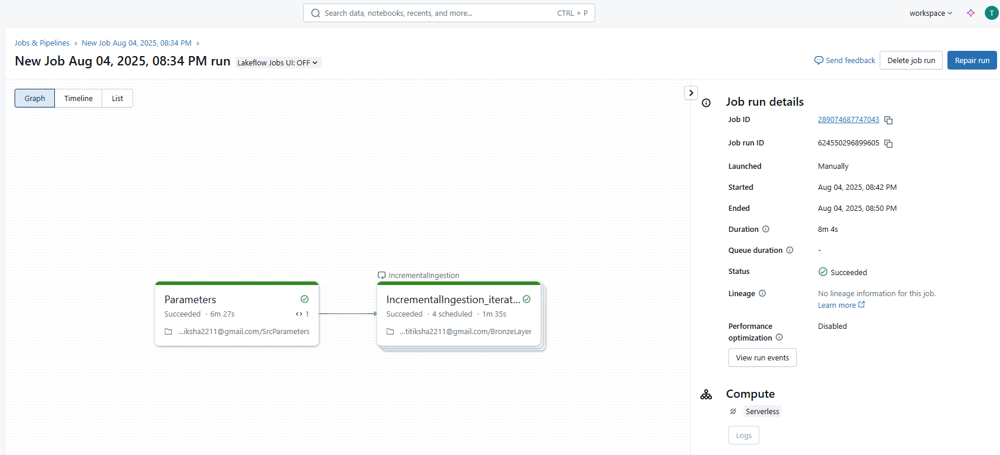

<h1>DATABRICKS x DBT End-To-End Data Engineering Project</h1>

<!-- Introduction -->
<h2>Introduction</h2>

This project demonstrates an end-to-end data ingestion pipeline using Databricks, leveraging Unity Catalog for data governance, Auto Loader for incremental data ingestion, and Databricks Workflows for pipeline automation.

<!-- Tools -->
<h2>Tools and Concepts</h2>

For this project, I used Databricks to implement key concepts such as data ingestion, dynamic pipelines, and efficient data organization within the storage account.

<!-- Understanding Dataset  -->
<h2>Understanding Dataset</h2>

I have four files on my GitHub page: dim_flights.csv,dim_passengers.csv,dim_airports.csv,fact_bookings.csv. I will ingest these files into Databricks. To manage this process, I am using netflix_titles.csv as a validation file. Then created directory ‘rawdata’ and created new folders ‘flights’ , ‘airports’, ‘bookings’ and ‘customers’ and uploaded dim_flights,dim_passengers,dim_airports and fact_bookings in the new folders created under ‘rawdata’ folder..

<h2>Create Schema for the Layers<h2>

Created schema for bronze, silver and gold. Within these new schemas, created volumes ‘bronzevolume’,’silvervolume’ and ‘goldvolume’ respectively.

<h2>Created dynamic parameter to read the files</h2>

Using the parameter, we read the csv files in the bronze, silver and gold layers. Also added checkpoint location in the volume folder.

Created an array which will be used as an input in another notebook. Then created a dictionary that use that array.

<h2>Create pipeline under workflows</h2>

After creating dynamic parameters, I added task in the pipeline by adding the path and depends 

Linked services act as connection strings that allow ADF to securely connect to various data sources and destinations, such as the GitHub data source and the Azure Data Lake Storage Gen2 containers.

  <ul>
    <li>
      <strong>Path:</strong>put the path of BronzeLayer notebook 
      <em>Depends On: Parameters.Add parameters:.</em>
    </li>
     
    <li>
      <strong>Value:</strong>{{input.src}} (added after the loop is done) 
      <em>Make a loop for this task => Put Input: {{tasks.Parameters.values.output_key}}</em>
    </li>
  </ul>

<h2>SilverNotebook Creation</h2>

After running the select query to see the data in the bronzelayer.We try to transformation in the silver layer using DLT.We will create rules using dictionary

If you look at the screenshot above, you’ll notice that all the files share the same relative URL, with only the file names varying. Because of this, I created a dynamic pipeline that uses parameters to handle the different file names. This allows me to use a single pipeline to ingest all the files easily, without needing to build separate pipelines for each one. It’s a straightforward but effective way to keep the process scalable and efficient.

<h3>Parameter Values in Dynamic Pipelines</h3>

After setting up the parameters for both the source and sink and referencing them in the relative URL and file path, I needed to provide actual values for each parameter. These values help the pipeline know which file to pull from the source and where exactly to place it in the sink, making the data flow specific to each dataset.

<h3>How I Set Up Parameter Values in Dynamic Pipelines</h3>

To make use of the parameters for different files, I used the ForEach activity in Azure Data Factory. The ForEach activity helps repeat a set of steps for every item in a list. In my setup, I created an array parameter that holds values in JSON format. Each entry contains a folder name and a file name. This allowed the pipeline to loop through the list and process each file one by one using the same dynamic structure.

Once the array was created, I used it in the settings of the ForEach activity to configure the items it would iterate over. This setup allowed the pipeline to loop through each file and folder combination from the array and process them accordingly.

<h3>Embedding the Copy Activity within the ForEach loop</h3>

After setting up the ForEach activity, I placed the Copy Activity inside it. This way, the loop can run through each item in the array and use the Copy Activity to transfer data from the source to the sink for each file. It ensures that every file is processed one by one based on the parameters defined.

<h3>Passing Dynamic Values to Copy Activity Parameters</h3>

After configuring the ForEach activity, I provided the actual values to the parameters in both the source and sink settings of the Copy activity. For the source, I used @item().file_name, and for the sink, I used both @item().folder_name and @item().file_name. This setup ensures that during each iteration, the pipeline dynamically picks the right file from the source and places it into the correct folder in the destination.

<h3>Running the pipeline</h3>

After setting up the Validation, ForEach, and Copy activities, I went ahead and triggered the pipeline. It ran successfully, first checking for the netflix_titles.csv file in the raw container, and then looping through the files to load them into the bronze container without any issues.

<h2>Success</h2>

